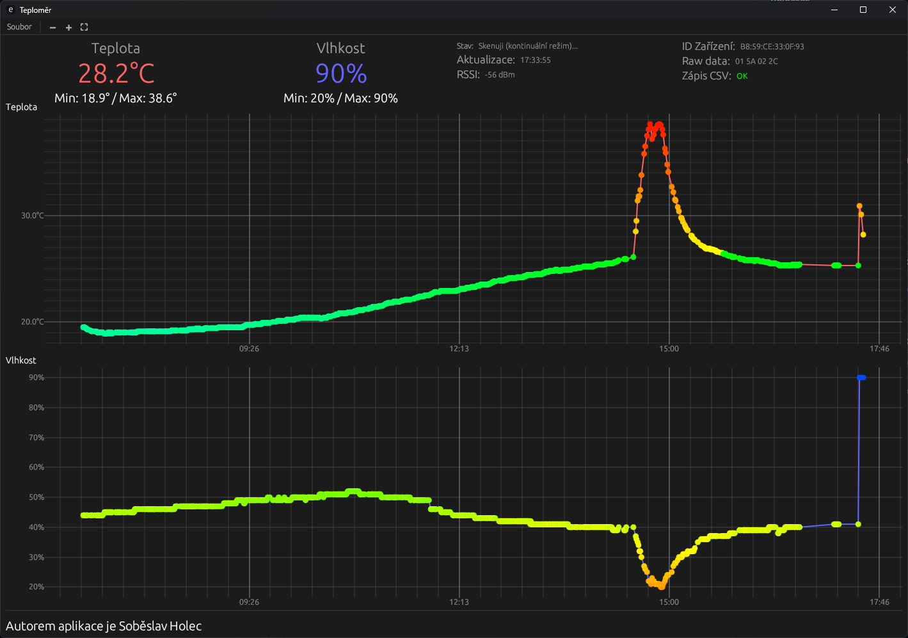

# Thermopro TP357 PC App

Jednoduchá aplikace pro monitorování teploty a vlhkosti z Bluetooth LE (BLE) senzoru, primárně určená pro **Thermopro TP357**. Aplikace je napsaná v jazyce Rust s využitím frameworku `egui`, zobrazuje aktuální data, jejich historii v grafech a ukládá je do CSV souboru.

 <!-- volitelné -->

## ✨ Funkce
- Připojení k zařízení **Thermopro TP357** přes Bluetooth.
- Zobrazení teploty a vlhkosti v reálném čase.
- Grafická vizualizace dat (pomocí [egui](https://github.com/emilk/egui)).
- Ukládání nastavení do `config.json`.
- Načtení historie posledních `200` měření, nebo všech záznamů.
- Logování událostí (info, warning, error).

Data z BLE senzoru jsou dekódována specifickým způsobem – předpokládá se, že teplota a vlhkost jsou součástí tzv. "manufacturer data" v BLE inzerci (advertising packet).

## 🚀 Instalace a spuštění

### Požadavky
- Rust (nejlépe aktuální stable verze)  
- Funkční Bluetooth adaptér  
- Windows / Linux / macOS  
- teploměr Thermopro TP357  

### Build & run
```bash
# Klonování repozitáře
git clone https://github.com/crapper001/Thermopro-TP357-PC-app.git
cd Thermopro-TP357-PC-app

# Kompilace a spuštění
cargo run --release
Spustí se okno aplikace s grafem a aktuálními daty.

⚙️ Konfigurace

Aplikace používá soubor config.json v aktuálním adresáři.

Příklad:
{
  "target_mac": "B8:59:CE:33:0F:93",
  "scan_timeout_secs": 20,
  "scan_pause_secs": 20,
  "duplicate_threshold_secs": 30,
  "temp_warn_high": 33.5,
  "temp_warn_low": 10.0,
  "continuous_mode": true,
  "load_all_history": false
}

target_device – název/ID Bluetooth zařízení.

update_interval_ms – interval čtení dat v milisekundách.

🛠️ Možné úpravy do budoucna

Oddělení kódu do více modulů (ui.rs, config.rs, bluetooth.rs).

Přidání testů.

Možnost exportu dat do CSV.

Lepší správa konfigurace (uložení do AppData/Home dir).

Balení do instalátoru pro Windows (MSI/EXE).